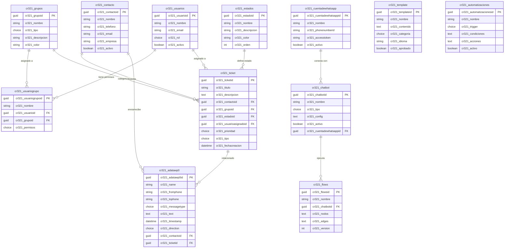
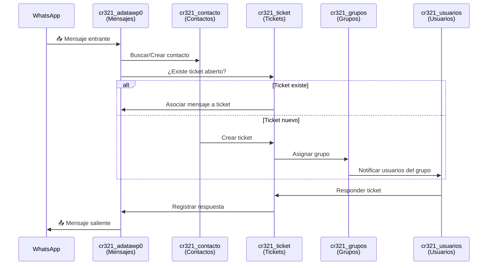
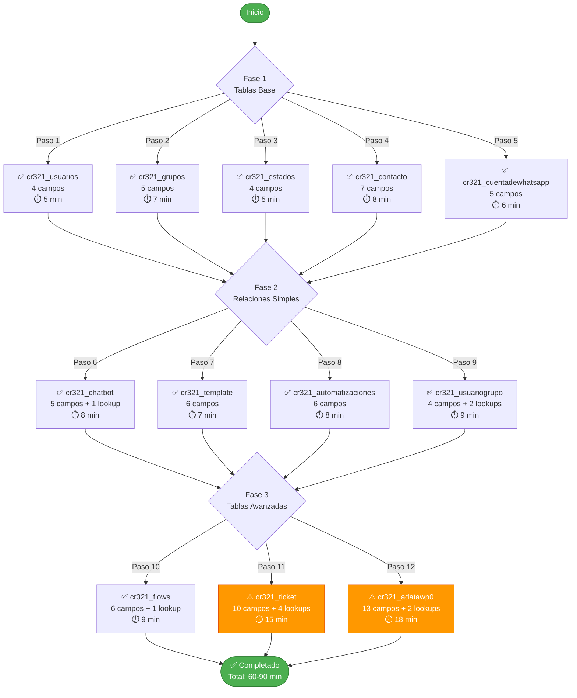
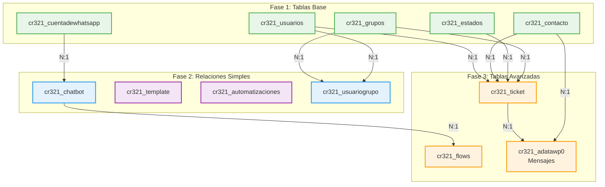
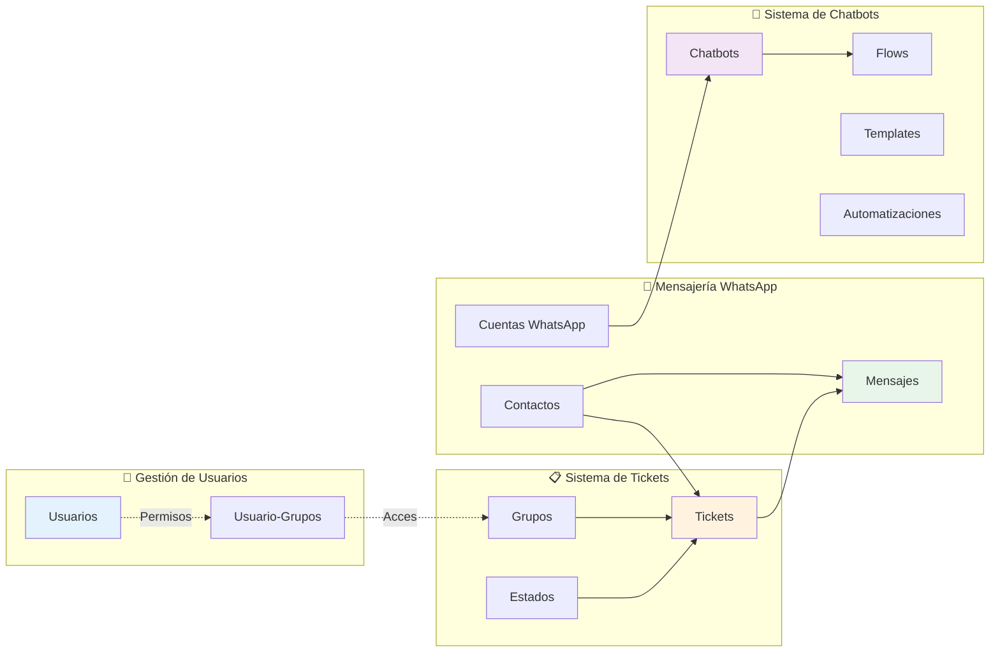

# 📋 Guía Completa: Crear TODAS las Tablas en Dataverse

## 🎯 Objetivo
Crear las **12 tablas** del Sistema WhatsApp CRM en Microsoft Dataverse con todos los campos necesarios.

---

## 📍 Antes de Comenzar

### Acceso a Power Apps
1. Ir a: https://make.powerapps.com
2. Iniciar sesión con tu cuenta Microsoft
3. Seleccionar tu entorno (arriba a la derecha)
4. Verificar que el prefijo del editor sea **cr321**

### Tiempo Estimado
- ⏱️ **60-90 minutos** para crear todas las tablas
- 💡 **Consejo:** Crea primero las tablas independientes, luego las que tienen relaciones

---

## �️ MAPA COMPLETO DE TABLAS

### 📊 Modelo Entidad-Relación (ER Diagram)



### 📋 Resumen de Tablas con Campos

| # | Tabla | Campos | Lookups | Opciones | Complejidad |
|---|-------|--------|---------|----------|-------------|
| 1 | 👥 **cr321_usuarios** | 4 | 0 | 1 | 🟢 Baja |
| 2 | 📁 **cr321_grupos** | 5 | 0 | 1 | 🟢 Baja |
| 3 | 🎯 **cr321_estados** | 4 | 0 | 0 | 🟢 Baja |
| 4 | 👤 **cr321_contacto** | 7 | 0 | 0 | 🟢 Baja |
| 5 | 📱 **cr321_cuentadewhatsapp** | 5 | 0 | 0 | 🟢 Baja |
| 6 | 🤖 **cr321_chatbot** | 5 | 1 | 1 | 🟢 Baja |
| 7 | 📄 **cr321_template** | 6 | 0 | 1 | 🟢 Baja |
| 8 | ⚙️ **cr321_automatizaciones** | 6 | 0 | 1 | 🟢 Baja |
| 9 | 🔗 **cr321_usuariogrupo** | 4 | 2 | 1 | 🟡 Media |
| 10 | 🔄 **cr321_flows** | 6 | 1 | 0 | 🟢 Baja |
| 11 | 🎫 **cr321_ticket** | 10 | 4 | 2 | 🔴 Alta |
| 12 | 💬 **cr321_adatawp0** | 13 | 2 | 3 | 🔴 Alta |

**Total:** 75 campos • 10 relaciones • 11 conjuntos de opciones

### 🎨 Mapa Visual por Subsistemas

```
┌────────────────────────────────────────────────────────────────────┐
│                    🏗️ SISTEMA WHATSAPP CRM                         │
└────────────────────────────────────────────────────────────────────┘

    ┌──────────────────────┐         ┌──────────────────────┐
    │   👥 USUARIOS        │         │   📋 TICKETS         │
    │                      │         │                      │
    │  cr321_usuarios      │◄────┐   │  cr321_ticket        │
    │  • nombre            │     │   │  • titulo            │
    │  • email             │     │   │  • descripcion       │
    │  • rol (Admin/User)  │     │   │  • prioridad         │
    │  • activo            │     │   │  • tipo              │
    └──────┬───────────────┘     │   └───┬────────────┬─────┘
           │                     │       │            │
           │ N:1                 │       │N:1         │N:1
           ▼                     │       ▼            │
    ┌──────────────────────┐    │   ┌─────────────┐  │
    │  cr321_usuariogrupo  │    │   │ cr321_grupos│  │
    │  • usuario_id ───────┼────┘   │ • nombre    │◄─┘
    │  • grupo_id ─────────┼───────►│ • tipo      │
    │  • permisos          │        │ • color     │
    └──────────────────────┘        └─────────────┘
                                           │N:1
                                           ▼
                                    ┌─────────────┐
                                    │cr321_estados│
                                    │ • nombre    │
                                    │ • orden     │
                                    └─────────────┘

    ┌──────────────────────┐         ┌──────────────────────┐
    │  💬 MENSAJERIA       │         │   🤖 CHATBOTS        │
    │                      │         │                      │
    │  cr321_adatawp0      │         │  cr321_chatbot       │
    │  • from/to phone     │         │  • nombre            │
    │  • text              │         │  • tipo (FlowBot/AI) │
    │  • messagetype       │         │  • config (JSON)     │
    │  • direction         │         │  • activo            │
    └───┬──────────────┬───┘         └──────┬───────────────┘
        │N:1           │N:1                 │N:1
        ▼              ▼                    ▼
    ┌──────────┐   ┌─────────┐      ┌──────────────────┐
    │cr321_    │   │cr321_   │      │cr321_cuentade    │
    │contacto  │   │ticket   │      │whatsapp          │
    │• nombre  │   │         │      │• phonenumberid   │
    │• telefono│   │         │      │• accesstoken     │
    │• empresa │   │         │      │• activo          │
    └──────────┘   └─────────┘      └──────┬───────────┘
                                            │N:1
                                            ▼
                                     ┌──────────────┐
                                     │ cr321_flows  │
                                     │ • nodos JSON │
                                     │ • edges JSON │
                                     │ • version    │
                                     └──────────────┘

    ┌──────────────────────┐         ┌──────────────────────┐
    │  📄 PLANTILLAS       │         │  ⚙️ AUTOMATIZACION   │
    │                      │         │                      │
    │  cr321_template      │         │  cr321_              │
    │  • nombre            │         │  automatizaciones    │
    │  • contenido         │         │  • trigger           │
    │  • categoria         │         │  • condiciones JSON  │
    │  • idioma (es)       │         │  • acciones JSON     │
    │  • aprobado (Meta)   │         │  • activo            │
    └──────────────────────┘         └──────────────────────┘
    
    [INDEPENDIENTES - Sin relaciones con otras tablas]
```

### 🎯 Propósito y Uso de Cada Tabla

| Tabla | Icono | Propósito Principal | Uso en el Sistema |
|-------|-------|---------------------|-------------------|
| **cr321_usuarios** | 👥 | Gestión de usuarios del sistema | Login, permisos, asignación de tickets |
| **cr321_grupos** | 📁 | Categorización de conversaciones | Menú WhatsApp (4 opciones), filtros |
| **cr321_estados** | 🎯 | Estados del ciclo de vida | Nuevo → En proceso → Resuelto → Cerrado |
| **cr321_contacto** | 👤 | Base de datos de contactos | Info del cliente, empresa, teléfono |
| **cr321_cuentadewhatsapp** | 📱 | Múltiples conexiones WhatsApp | Soporta varias cuentas Business |
| **cr321_chatbot** | 🤖 | Configuración de bots | FlowBot, Simple, AI Assistant |
| **cr321_template** | 📄 | Plantillas aprobadas por Meta | Mensajes pre-aprobados, marketing |
| **cr321_automatizaciones** | ⚙️ | Respuestas automáticas | Palabras clave, horarios, triggers |
| **cr321_usuariogrupo** | 🔗 | Permisos por grupo | Qué usuarios ven qué grupos |
| **cr321_flows** | 🔄 | Flujos de conversación | Nodos y conexiones visuales |
| **cr321_ticket** | 🎫 | Sistema de tickets de soporte | Gestión de casos, asignación |
| **cr321_adatawp0** | 💬 | Mensajes WhatsApp (todos) | Historial completo de conversaciones |

### 📊 Flujo de Datos del Sistema



### 🗂️ Índice Rápido de Navegación por Tabla

| Fase | Tabla | Ir a Sección | Campos | Tiempo |
|------|-------|--------------|--------|--------|
| **1** | 👥 cr321_usuarios | [Crear →](#tabla-1-cr321_usuarios) | 4 | 5 min |
| **1** | 📁 cr321_grupos | [Crear →](#tabla-2-cr321_grupos) | 5 | 7 min |
| **1** | 🎯 cr321_estados | [Crear →](#tabla-3-cr321_estados) | 4 | 5 min |
| **1** | 👤 cr321_contacto | [Crear →](#tabla-4-cr321_contacto) | 7 | 8 min |
| **1** | 📱 cr321_cuentadewhatsapp | [Crear →](#tabla-5-cr321_cuentadewhatsapp) | 5 | 6 min |
| **2** | 🤖 cr321_chatbot | [Crear →](#tabla-6-cr321_chatbot) | 5+1 | 8 min |
| **2** | 📄 cr321_template | [Crear →](#tabla-7-cr321_template) | 6 | 7 min |
| **2** | ⚙️ cr321_automatizaciones | [Crear →](#tabla-8-cr321_automatizaciones) | 6 | 8 min |
| **2** | 🔗 cr321_usuariogrupo | [Crear →](#tabla-9-cr321_usuariogrupo) | 4+2 | 9 min |
| **3** | 🔄 cr321_flows | [Crear →](#tabla-10-cr321_flows) | 6+1 | 9 min |
| **3** | 🎫 cr321_ticket | [Crear →](#tabla-11-cr321_ticket) | 10+4 | 15 min |
| **3** | 💬 cr321_adatawp0 | [Crear →](#tabla-12-cr321_adatawp0-mensajes) | 13+2 | 18 min |

**Leyenda:** Campos base + Campos lookup (relaciones)

---

## �🗂️ Orden de Creación Recomendado

### 📊 Diagrama de Flujo de Creación



### Fase 1: Tablas Base (Sin dependencias)
**⏱️ Tiempo estimado: 30-35 minutos**

1. ✅ cr321_usuarios (4 campos)
2. ✅ cr321_grupos (5 campos)
3. ✅ cr321_estados (4 campos)
4. ✅ cr321_contacto (7 campos)
5. ✅ cr321_cuentadewhatsapp (5 campos)

### Fase 2: Tablas con Relaciones Simples
**⏱️ Tiempo estimado: 30-35 minutos**

6. ✅ cr321_chatbot (5 campos + 1 lookup)
7. ✅ cr321_template (6 campos)
8. ✅ cr321_automatizaciones (6 campos)
9. ✅ cr321_usuariogrupo (4 campos + 2 lookups)

### Fase 3: Tablas Avanzadas
**⏱️ Tiempo estimado: 40-45 minutos**

10. ✅ cr321_flows (6 campos + 1 lookup)
11. ⚠️ cr321_ticket (10 campos + 4 lookups) - **Compleja**
12. ⚠️ cr321_adatawp0 (13 campos + 2 lookups) - **Compleja**

---

## 🏗️ FASE 1: Tablas Base

### Tabla 1: cr321_usuarios

**Navegación:** Tablas → Nueva tabla → Crear tabla

**Información básica:**
```
Nombre para mostrar: Usuario
Nombre plural: Usuarios
Nombre: cr321_usuarios
Descripción: Usuarios del sistema con roles y permisos
```

**Campos a crear:**

| Campo | Tipo | Longitud | ¿Obligatorio? | Descripción |
|-------|------|----------|---------------|-------------|
| cr321_nombre | Texto | 100 | ✅ Sí | Nombre completo (campo principal) |
| cr321_email | Texto | 200 | ✅ Sí | Correo electrónico |
| cr321_rol | Conjunto de opciones | - | ✅ Sí | Rol del usuario |
| cr321_activo | Sí/No | - | ❌ No | Usuario activo |

**Opciones para cr321_rol:**
```
Etiqueta: Administrador    Valor: 462410000
Etiqueta: Usuario          Valor: 462410001
Etiqueta: Supervisor       Valor: 462410002
```

**Valores predeterminados:**
- cr321_rol: 462410001 (Usuario)
- cr321_activo: Sí (true)

✅ **Guardar y publicar**

---

### Tabla 2: cr321_grupos

**Información básica:**
```
Nombre para mostrar: Grupo
Nombre plural: Grupos
Nombre: cr321_grupos
Descripción: Grupos para categorización de conversaciones
```

**Campos a crear:**

| Campo | Tipo | Longitud | ¿Obligatorio? | Descripción |
|-------|------|----------|---------------|-------------|
| cr321_nombre | Texto | 100 | ✅ Sí | Nombre del grupo (campo principal) |
| cr321_tipo | Conjunto de opciones | - | ✅ Sí | Tipo de grupo |
| cr321_descripcion | Texto | 500 | ❌ No | Descripción del grupo |
| cr321_color | Texto | 20 | ❌ No | Color hexadecimal para UI |
| cr321_icono | Texto | 50 | ❌ No | Nombre del icono |

**Opciones para cr321_tipo:**
```
Etiqueta: Tipo A    Valor: 462410000  (Menú WhatsApp)
Etiqueta: Tipo B    Valor: 462410001  (Categorías internas)
Etiqueta: Tipo C    Valor: 462410002  (Etiquetas)
```

**Valores predeterminados:**
- cr321_tipo: 462410000 (Tipo A)

✅ **Guardar y publicar**

---

### Tabla 3: cr321_estados

**Información básica:**
```
Nombre para mostrar: Estado
Nombre plural: Estados
Nombre: cr321_estados
Descripción: Estados para tickets y conversaciones
```

**Campos a crear:**

| Campo | Tipo | Longitud | ¿Obligatorio? | Descripción |
|-------|------|----------|---------------|-------------|
| cr321_nombre | Texto | 100 | ✅ Sí | Nombre del estado (campo principal) |
| cr321_descripcion | Texto | 500 | ❌ No | Descripción del estado |
| cr321_color | Texto | 20 | ❌ No | Color hexadecimal para UI |
| cr321_orden | Número entero | - | ❌ No | Orden de visualización |

**Valores predeterminados:**
- cr321_orden: 0

✅ **Guardar y publicar**

---

### Tabla 4: cr321_contacto

**Información básica:**
```
Nombre para mostrar: Contacto
Nombre plural: Contactos
Nombre: cr321_contacto
Descripción: Información de contactos de WhatsApp
```

**Campos a crear:**

| Campo | Tipo | Longitud | ¿Obligatorio? | Descripción |
|-------|------|----------|---------------|-------------|
| cr321_nombre | Texto | 100 | ✅ Sí | Nombre del contacto (campo principal) |
| cr321_telefono | Texto | 20 | ✅ Sí | Número de teléfono |
| cr321_email | Texto | 200 | ❌ No | Correo electrónico |
| cr321_empresa | Texto | 200 | ❌ No | Empresa |
| cr321_cargo | Texto | 100 | ❌ No | Cargo |
| cr321_notas | Texto multilínea | 5000 | ❌ No | Notas adicionales |
| cr321_activo | Sí/No | - | ❌ No | Contacto activo |

**Valores predeterminados:**
- cr321_activo: Sí (true)

✅ **Guardar y publicar**

---

### Tabla 5: cr321_cuentadewhatsapp

**Información básica:**
```
Nombre para mostrar: Cuenta de WhatsApp
Nombre plural: Cuentas WhatsApp
Nombre: cr321_cuentadewhatsapp
Descripción: Conexiones de WhatsApp Business múltiples
```

**Campos a crear:**

| Campo | Tipo | Longitud | ¿Obligatorio? | Descripción |
|-------|------|----------|---------------|-------------|
| cr321_nombre | Texto | 100 | ✅ Sí | Nombre descriptivo (campo principal) |
| cr321_phonenumberid | Texto | 50 | ✅ Sí | Phone Number ID de Meta |
| cr321_accesstoken | Texto | 500 | ✅ Sí | Access Token de Meta |
| cr321_verifytoken | Texto | 100 | ❌ No | Verify Token para webhook |
| cr321_activo | Sí/No | - | ❌ No | Cuenta activa |

**Valores predeterminados:**
- cr321_activo: Sí (true)

✅ **Guardar y publicar**

---

## 🔗 FASE 2: Tablas con Relaciones Simples

### Tabla 6: cr321_chatbot

**Información básica:**
```
Nombre para mostrar: Chatbot
Nombre plural: Chatbots
Nombre: cr321_chatbot
Descripción: Configuración de chatbots de WhatsApp
```

**Campos a crear:**

| Campo | Tipo | Longitud/Relación | ¿Obligatorio? | Descripción |
|-------|------|-------------------|---------------|-------------|
| cr321_nombre | Texto | 100 | ✅ Sí | Nombre del bot (campo principal) |
| cr321_tipo | Conjunto de opciones | - | ❌ No | Tipo de bot |
| cr321_config | Texto multilínea | 100000 | ❌ No | Configuración JSON |
| cr321_activo | Sí/No | - | ❌ No | Bot activo |
| cr321_cuentadewhatsappid | Búsqueda | → cr321_cuentadewhatsapp | ❌ No | Cuenta de WhatsApp |

**Opciones para cr321_tipo:**
```
Etiqueta: FlowBot         Valor: 462410000
Etiqueta: Simple          Valor: 462410001
Etiqueta: AI Assistant    Valor: 462410002
```

**Campo de búsqueda cr321_cuentadewhatsappid:**
- Tipo: Búsqueda
- Tabla relacionada: cr321_cuentadewhatsapp
- Relación: Muchos a uno (N:1)

**Valores predeterminados:**
- cr321_tipo: 462410000 (FlowBot)
- cr321_activo: Sí (true)

✅ **Guardar y publicar**

---

### Tabla 7: cr321_template

**Información básica:**
```
Nombre para mostrar: Plantilla
Nombre plural: Plantillas
Nombre: cr321_template
Descripción: Plantillas de mensajes de WhatsApp aprobadas
```

**Campos a crear:**

| Campo | Tipo | Longitud | ¿Obligatorio? | Descripción |
|-------|------|----------|---------------|-------------|
| cr321_nombre | Texto | 100 | ✅ Sí | Nombre de la plantilla (campo principal) |
| cr321_contenido | Texto multilínea | 5000 | ✅ Sí | Contenido del mensaje |
| cr321_categoria | Conjunto de opciones | - | ❌ No | Categoría del template |
| cr321_idioma | Texto | 10 | ❌ No | Código de idioma |
| cr321_aprobado | Sí/No | - | ❌ No | Aprobada por Meta |
| cr321_templateid | Texto | 100 | ❌ No | ID del template en Meta |

**Opciones para cr321_categoria:**
```
Etiqueta: Marketing    Valor: 462410000
Etiqueta: Servicio     Valor: 462410001
Etiqueta: Ventas       Valor: 462410002
Etiqueta: Soporte      Valor: 462410003
```

**Valores predeterminados:**
- cr321_idioma: es
- cr321_aprobado: No (false)

✅ **Guardar y publicar**

---

### Tabla 8: cr321_automatizaciones

**Información básica:**
```
Nombre para mostrar: Automatización
Nombre plural: Automatizaciones
Nombre: cr321_automatizaciones
Descripción: Reglas de automatización para respuestas
```

**Campos a crear:**

| Campo | Tipo | Longitud | ¿Obligatorio? | Descripción |
|-------|------|----------|---------------|-------------|
| cr321_nombre | Texto | 100 | ✅ Sí | Nombre de la regla (campo principal) |
| cr321_trigger | Conjunto de opciones | - | ❌ No | Tipo de disparador |
| cr321_condiciones | Texto multilínea | 10000 | ❌ No | Condiciones en JSON |
| cr321_acciones | Texto multilínea | 10000 | ❌ No | Acciones en JSON |
| cr321_activo | Sí/No | - | ❌ No | Regla activa |
| cr321_prioridad | Número entero | - | ❌ No | Prioridad de ejecución |

**Opciones para cr321_trigger:**
```
Etiqueta: Mensaje Recibido      Valor: 462410000
Etiqueta: Palabra Clave         Valor: 462410001
Etiqueta: Horario               Valor: 462410002
Etiqueta: Evento de Sistema     Valor: 462410003
```

**Valores predeterminados:**
- cr321_activo: Sí (true)
- cr321_prioridad: 100

✅ **Guardar y publicar**

---

### Tabla 9: cr321_usuariogrupo

**Información básica:**
```
Nombre para mostrar: Usuario Grupo
Nombre plural: Usuario Grupos
Nombre: cr321_usuariogrupo
Descripción: Relación entre usuarios y grupos (permisos)
```

**Campos a crear:**

| Campo | Tipo | Relación | ¿Obligatorio? | Descripción |
|-------|------|----------|---------------|-------------|
| cr321_nombre | Texto | 100 | ✅ Sí | Nombre descriptivo (campo principal) |
| cr321_usuarioid | Búsqueda | → cr321_usuarios | ✅ Sí | Usuario asignado |
| cr321_grupoid | Búsqueda | → cr321_grupos | ✅ Sí | Grupo asignado |
| cr321_permisos | Conjunto de opciones | - | ❌ No | Nivel de permisos |

**Campo de búsqueda cr321_usuarioid:**
- Tipo: Búsqueda
- Tabla relacionada: cr321_usuarios
- Relación: Muchos a uno (N:1)

**Campo de búsqueda cr321_grupoid:**
- Tipo: Búsqueda
- Tabla relacionada: cr321_grupos
- Relación: Muchos a uno (N:1)

**Opciones para cr321_permisos:**
```
Etiqueta: Solo lectura      Valor: 462410000
Etiqueta: Lectura/Escritura Valor: 462410001
Etiqueta: Administrador     Valor: 462410002
```

**Valores predeterminados:**
- cr321_permisos: 462410001 (Lectura/Escritura)

✅ **Guardar y publicar**

---

## 🚀 FASE 3: Tablas Avanzadas

### Tabla 10: cr321_flows

**Información básica:**
```
Nombre para mostrar: Flujo
Nombre plural: Flujos
Nombre: cr321_flows
Descripción: Flujos de conversación para chatbots
```

**Campos a crear:**

| Campo | Tipo | Longitud/Relación | ¿Obligatorio? | Descripción |
|-------|------|-------------------|---------------|-------------|
| cr321_nombre | Texto | 100 | ✅ Sí | Nombre del flujo (campo principal) |
| cr321_chatbotid | Búsqueda | → cr321_chatbot | ✅ Sí | Chatbot asociado |
| cr321_nodos | Texto multilínea | 100000 | ❌ No | Nodos del flujo en JSON |
| cr321_edges | Texto multilínea | 100000 | ❌ No | Conexiones en JSON |
| cr321_version | Número entero | - | ❌ No | Versión del flujo |
| cr321_activo | Sí/No | - | ❌ No | Flujo activo |

**Campo de búsqueda cr321_chatbotid:**
- Tipo: Búsqueda
- Tabla relacionada: cr321_chatbot
- Relación: Muchos a uno (N:1)

**Valores predeterminados:**
- cr321_version: 1
- cr321_activo: Sí (true)

✅ **Guardar y publicar**

---

### Tabla 11: cr321_ticket

**Información básica:**
```
Nombre para mostrar: Ticket
Nombre plural: Tickets
Nombre: cr321_ticket
Descripción: Sistema de tickets de soporte
```

**Campos a crear:**

| Campo | Tipo | Longitud/Relación | ¿Obligatorio? | Descripción |
|-------|------|-------------------|---------------|-------------|
| cr321_titulo | Texto | 200 | ✅ Sí | Título del ticket (campo principal) |
| cr321_descripcion | Texto multilínea | 5000 | ❌ No | Descripción del problema |
| cr321_contactoid | Búsqueda | → cr321_contacto | ✅ Sí | Contacto relacionado |
| cr321_grupoid | Búsqueda | → cr321_grupos | ❌ No | Grupo asignado |
| cr321_estadoid | Búsqueda | → cr321_estados | ✅ Sí | Estado actual |
| cr321_prioridad | Conjunto de opciones | - | ✅ Sí | Prioridad del ticket |
| cr321_tipo | Conjunto de opciones | - | ✅ Sí | Tipo de ticket |
| cr321_fechacreacion | Fecha y hora | - | ✅ Sí | Fecha de creación |
| cr321_fechaactualizacion | Fecha y hora | - | ✅ Sí | Última actualización |
| cr321_usuarioasignadoid | Búsqueda | → cr321_usuarios | ❌ No | Usuario asignado |

**Campos de búsqueda:**

**cr321_contactoid:**
- Tipo: Búsqueda
- Tabla relacionada: cr321_contacto
- Relación: Muchos a uno (N:1)

**cr321_grupoid:**
- Tipo: Búsqueda
- Tabla relacionada: cr321_grupos
- Relación: Muchos a uno (N:1)

**cr321_estadoid:**
- Tipo: Búsqueda
- Tabla relacionada: cr321_estados
- Relación: Muchos a uno (N:1)

**cr321_usuarioasignadoid:**
- Tipo: Búsqueda
- Tabla relacionada: cr321_usuarios
- Relación: Muchos a uno (N:1)

**Opciones para cr321_prioridad:**
```
Etiqueta: Baja      Valor: 462410000
Etiqueta: Media     Valor: 462410001
Etiqueta: Alta      Valor: 462410002
Etiqueta: Urgente   Valor: 462410003
```

**Opciones para cr321_tipo:**
```
Etiqueta: Soporte          Valor: 462410000
Etiqueta: Cotización       Valor: 462410001
Etiqueta: Información      Valor: 462410002
Etiqueta: Atención Agente  Valor: 462410003
```

**Valores predeterminados:**
- cr321_prioridad: 462410001 (Media)
- cr321_tipo: 462410000 (Soporte)
- cr321_fechacreacion: Fecha/hora actual
- cr321_fechaactualizacion: Fecha/hora actual

✅ **Guardar y publicar**

---

### Tabla 12: cr321_adatawp0 (Mensajes)

**Información básica:**
```
Nombre para mostrar: Mensaje WhatsApp
Nombre plural: Mensajes WhatsApp
Nombre: cr321_adatawp0
Descripción: Mensajes de WhatsApp (entrantes y salientes)
```

**Campos a crear:**

| Campo | Tipo | Longitud/Relación | ¿Obligatorio? | Descripción |
|-------|------|-------------------|---------------|-------------|
| cr321_name | Texto | 200 | ✅ Sí | Resumen del mensaje (campo principal) |
| cr321_fromphone | Texto | 20 | ✅ Sí | Número origen |
| cr321_tophone | Texto | 20 | ✅ Sí | Número destino |
| cr321_messagetype | Conjunto de opciones | - | ✅ Sí | Tipo de mensaje |
| cr321_text | Texto multilínea | 5000 | ❌ No | Contenido del mensaje |
| cr321_timestamp | Fecha y hora | - | ✅ Sí | Fecha/hora del mensaje |
| cr321_direction | Conjunto de opciones | - | ✅ Sí | Dirección del mensaje |
| cr321_status | Conjunto de opciones | - | ❌ No | Estado de entrega |
| cr321_contactoid | Búsqueda | → cr321_contacto | ❌ No | Contacto relacionado |
| cr321_ticketid | Búsqueda | → cr321_ticket | ❌ No | Ticket relacionado |
| cr321_mediaid | Texto | 100 | ❌ No | ID de media (imagen/audio) |
| cr321_mediaurl | Texto | 500 | ❌ No | URL de media |
| cr321_wamid | Texto | 100 | ❌ No | WhatsApp Message ID |

**Campos de búsqueda:**

**cr321_contactoid:**
- Tipo: Búsqueda
- Tabla relacionada: cr321_contacto
- Relación: Muchos a uno (N:1)

**cr321_ticketid:**
- Tipo: Búsqueda
- Tabla relacionada: cr321_ticket
- Relación: Muchos a uno (N:1)

**Opciones para cr321_messagetype:**
```
Etiqueta: Texto      Valor: 462410000
Etiqueta: Imagen     Valor: 462410001
Etiqueta: Audio      Valor: 462410002
Etiqueta: Video      Valor: 462410003
Etiqueta: Documento  Valor: 462410004
```

**Opciones para cr321_direction:**
```
Etiqueta: Entrante    Valor: 462410000
Etiqueta: Saliente    Valor: 462410001
```

**Opciones para cr321_status:**
```
Etiqueta: Enviado     Valor: 462410000
Etiqueta: Entregado   Valor: 462410001
Etiqueta: Leído       Valor: 462410002
Etiqueta: Error       Valor: 462410003
```

**Valores predeterminados:**
- cr321_messagetype: 462410000 (Texto)
- cr321_status: 462410000 (Enviado)

✅ **Guardar y publicar**

---

## 📸 Guía Visual de Creación de Campos

### Crear campo de Texto:
```
1. En la tabla, clic en "+ Agregar campo"
2. Nombre para mostrar: [nombre del campo sin prefijo]
3. Nombre: [se autogenera con cr321_]
4. Tipo de datos: Texto
5. Longitud máxima: [según tabla]
6. ¿Obligatorio?: [marcar si es obligatorio]
7. Guardar
```

### Crear campo de Texto Multilínea:
```
1. En la tabla, clic en "+ Agregar campo"
2. Nombre para mostrar: [nombre del campo]
3. Tipo de datos: Texto
4. Formato: Texto → Área de texto
5. Longitud máxima: [5000, 10000 o 100000]
6. ¿Obligatorio?: [según tabla]
7. Guardar
```

### Crear campo Sí/No (Booleano):
```
1. En la tabla, clic en "+ Agregar campo"
2. Nombre para mostrar: [nombre del campo]
3. Tipo de datos: Sí/No
4. Valor predeterminado: [Sí o No según tabla]
5. Guardar
```

### Crear campo de Conjunto de Opciones:
```
1. En la tabla, clic en "+ Agregar campo"
2. Nombre para mostrar: [nombre del campo]
3. Tipo de datos: Elección → Elección
4. Sincronizar con elección global: No
5. Para cada opción:
   - Clic en "+ Nueva elección"
   - Etiqueta: [nombre de la opción]
   - Valor: [número de 9 dígitos, ej: 462410000]
6. Valor predeterminado: [seleccionar según tabla]
7. Guardar
```

### Crear campo de Búsqueda (Lookup):
```
1. En la tabla, clic en "+ Agregar campo"
2. Nombre para mostrar: [nombre del campo]
3. Tipo de datos: Búsqueda → Búsqueda
4. Tabla relacionada: [seleccionar tabla de la lista]
5. Tipo de relación: Muchos a uno (N:1)
6. ¿Obligatorio?: [según tabla]
7. Guardar
```

### Crear campo de Fecha y Hora:
```
1. En la tabla, clic en "+ Agregar campo"
2. Nombre para mostrar: [nombre del campo]
3. Tipo de datos: Fecha y hora
4. Comportamiento: Fecha y hora del usuario
5. Formato: Fecha y hora
6. ¿Obligatorio?: [según tabla]
7. Guardar
```

### Crear campo de Número Entero:
```
1. En la tabla, clic en "+ Agregar campo"
2. Nombre para mostrar: [nombre del campo]
3. Tipo de datos: Número entero
4. Valor mínimo: [opcional]
5. Valor máximo: [opcional]
6. Valor predeterminado: [según tabla]
7. Guardar
```

---

## 🎯 Verificación de Tablas Creadas

Después de completar todas las creaciones, verificar en Power Apps:

### ✅ Checklist Completo

**Fase 1: Tablas Base**
- [ ] cr321_usuarios (4 campos)
- [ ] cr321_grupos (5 campos)
- [ ] cr321_estados (4 campos)
- [ ] cr321_contacto (7 campos)
- [ ] cr321_cuentadewhatsapp (5 campos)

**Fase 2: Tablas con Relaciones**
- [ ] cr321_chatbot (5 campos)
- [ ] cr321_template (6 campos)
- [ ] cr321_automatizaciones (6 campos)
- [ ] cr321_usuariogrupo (4 campos)

**Fase 3: Tablas Avanzadas**
- [ ] cr321_flows (6 campos)
- [ ] cr321_ticket (10 campos)
- [ ] cr321_adatawp0 (13 campos)

**Total: 12 tablas creadas** ✅

---

## 🚀 Paso Final: Inicializar Datos

Una vez creadas y publicadas TODAS las tablas, ejecutar el script de inicialización:

```powershell
# Activar entorno virtual
.\venv_clean\Scripts\Activate.ps1

# Ejecutar script
python init_dataverse.py
```

**El script creará:**
- ✅ 4 grupos tipo A (SERVICIOS, COTIZACIONES, SOPORTE, GENERAL)
- ✅ 6 estados (NUEVO, EN_PROCESO, ESPERANDO, RESUELTO, CERRADO, CANCELADO)

---

## 🆘 Solución de Problemas Comunes

### Problema: No puedo crear campos con prefijo cr321_
**Solución:** 
1. Ve a Configuración → Soluciones
2. Selecciona tu solución
3. Ve a Configuración de editor
4. Verifica que el prefijo sea "cr321"

### Problema: No encuentro "Conjunto de opciones"
**Solución:** 
- En versiones en inglés se llama "Choice"
- Busca "Elección" en español

### Problema: Error al crear relación de búsqueda
**Solución:** 
1. La tabla relacionada debe existir primero
2. La tabla relacionada debe estar publicada
3. Sigue el orden de creación recomendado

### Problema: Los valores de las opciones no se guardan
**Solución:** 
- Asegúrate de usar exactamente los valores numéricos indicados
- Usa el formato: 462410000, 462410001, etc.
- No uses valores duplicados

### Problema: Error al publicar tabla
**Solución:** 
1. Verifica que no haya campos duplicados
2. Asegúrate de que todos los campos obligatorios estén configurados
3. Revisa que las relaciones sean válidas
4. Intenta publicar campo por campo si hay error

---

## 📊 Resumen de Relaciones y Arquitectura

### 🗺️ Diagrama Completo de Relaciones



### 📐 Diagrama de Dependencias ASCII

```
┌─────────────────────────────────────────────────────────────┐
│                     FASE 1: TABLAS BASE                      │
└─────────────────────────────────────────────────────────────┘

  cr321_usuarios          cr321_grupos          cr321_estados
       │                       │                      │
       │                       │                      │
       └───────┬───────────────┴──────────┬───────────┘
               │                          │
               ▼                          ▼
        cr321_usuariogrupo         cr321_ticket
                                         ▲
                                         │
                                         │
  cr321_contacto ────────────────────────┴────────────┐
       │                                               │
       └─────────────────────────────────────────────►│
                                                       ▼
                                              cr321_adatawp0
                                                (Mensajes)

┌─────────────────────────────────────────────────────────────┐
│              SUBSISTEMA DE CHATBOTS                          │
└─────────────────────────────────────────────────────────────┘

  cr321_cuentadewhatsapp ──► cr321_chatbot ──► cr321_flows

┌─────────────────────────────────────────────────────────────┐
│              TABLAS INDEPENDIENTES                           │
└─────────────────────────────────────────────────────────────┘

     cr321_template              cr321_automatizaciones
```

### 🔗 Matriz de Relaciones Detallada

| Tabla Origen | Campo | → | Tabla Destino | Tipo |
|--------------|-------|---|---------------|------|
| **cr321_usuariogrupo** | cr321_usuarioid | → | cr321_usuarios | N:1 |
| **cr321_usuariogrupo** | cr321_grupoid | → | cr321_grupos | N:1 |
| **cr321_ticket** | cr321_contactoid | → | cr321_contacto | N:1 |
| **cr321_ticket** | cr321_grupoid | → | cr321_grupos | N:1 |
| **cr321_ticket** | cr321_estadoid | → | cr321_estados | N:1 |
| **cr321_ticket** | cr321_usuarioasignadoid | → | cr321_usuarios | N:1 |
| **cr321_adatawp0** | cr321_contactoid | → | cr321_contacto | N:1 |
| **cr321_adatawp0** | cr321_ticketid | → | cr321_ticket | N:1 |
| **cr321_chatbot** | cr321_cuentadewhatsappid | → | cr321_cuentadewhatsapp | N:1 |
| **cr321_flows** | cr321_chatbotid | → | cr321_chatbot | N:1 |

### 📈 Complejidad por Tabla

```
Complejidad Alta (4+ relaciones):
  🔴 cr321_ticket (4 lookups)     ⚠️ Crear al final
  🔴 cr321_adatawp0 (2 lookups)   ⚠️ Crear al final

Complejidad Media (2-3 relaciones):
  🟡 cr321_usuariogrupo (2 lookups)

Complejidad Baja (0-1 relaciones):
  🟢 cr321_usuarios (0 lookups)
  🟢 cr321_grupos (0 lookups)
  🟢 cr321_estados (0 lookups)
  🟢 cr321_contacto (0 lookups)
  🟢 cr321_cuentadewhatsapp (0 lookups)
  🟢 cr321_chatbot (1 lookup)
  🟢 cr321_template (0 lookups)
  🟢 cr321_automatizaciones (0 lookups)
  🟢 cr321_flows (1 lookup)
```

---

## 🎨 Diagrama de Arquitectura del Sistema



## 📊 Estadísticas del Sistema

| Métrica | Valor |
|---------|-------|
| **Total de Tablas** | 12 |
| **Total de Campos** | 75+ |
| **Total de Relaciones (Lookups)** | 10 |
| **Conjuntos de Opciones** | 15 |
| **Campos Obligatorios** | 28 |
| **Tiempo de Creación** | 60-90 min |
| **Complejidad** | Media-Alta |

### 🎯 Distribución de Campos por Tipo

```
📝 Texto Simple:           28 campos (37%)
📄 Texto Multilínea:       10 campos (13%)
🔗 Búsqueda (Lookup):      10 campos (13%)
☑️  Sí/No (Booleano):       8 campos (11%)
🔢 Número Entero:           3 campos (4%)
📅 Fecha y Hora:            4 campos (5%)
🎯 Conjunto de Opciones:   12 campos (16%)
```

## 💡 Consejos Finales

### ⚡ Para Mayor Eficiencia:

1. **Toma descansos cada 20-30 minutos** - Crear 12 tablas requiere concentración
2. **Verifica campo por campo** - Revisa cada campo antes de guardar
3. **Publica al final de cada fase** - No esperes al final para publicar
4. **Usa nombres descriptivos** - El campo principal debe ser claro
5. **Documenta personalizaciones** - Anota cualquier cambio que hagas
6. **Copia y pega valores exactos** - Especialmente los códigos de opciones (462410000)
7. **Ten la guía abierta** - Usa dos monitores o imprime la guía
8. **Valida las relaciones** - Verifica que los lookups apunten a la tabla correcta

### 🚨 Errores Comunes a Evitar:

| ❌ Error | ✅ Solución |
|----------|-------------|
| Crear lookups antes que la tabla relacionada | Seguir el orden de fases |
| Valores de opciones incorrectos | Copiar exactamente: 462410000, 462410001, etc. |
| Olvidar campos obligatorios | Revisar tabla antes de publicar |
| No publicar entre tablas | Publicar al final de cada fase |
| Nombres de campos incorrectos | Verificar prefijo cr321_ |
| Longitud insuficiente en texto | Revisar longitudes recomendadas |

---

## ✅ Siguiente Paso

Después de completar esta guía:

1. **Ejecutar init_dataverse.py** para datos iniciales
2. **Revisar** [GUIA_RAPIDA_USUARIO_GRUPOS.md](GUIA_RAPIDA_USUARIO_GRUPOS.md)
3. **Iniciar backend:** `.\iniciar_backend.ps1`
4. **Iniciar frontend:** `.\iniciar.ps1`

---

## 📖 Referencias

- [Power Apps Documentation](https://learn.microsoft.com/power-apps/)
- [Dataverse Table Documentation](https://learn.microsoft.com/power-apps/maker/data-platform/entity-overview)
- [INICIO_RAPIDO.md](INICIO_RAPIDO.md) - Guía de inicio del sistema
- [INDICE_DOCUMENTACION.md](INDICE_DOCUMENTACION.md) - Índice completo

---

**Tiempo total estimado:** 60-90 minutos  
**Dificultad:** Media  
**Última actualización:** Febrero 2026
