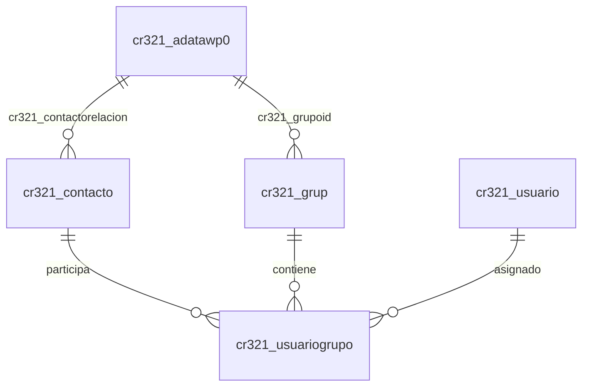

# 🗺️ Mapa de la Aplicación WhatsApp CRM

## 📁 Estructura del Proyecto

```
CLAUDE-1/
├── backend/              # API Flask + Dataverse
│   ├── back.py          # [SERVIDOR PRINCIPAL]
│   ├── goot.py          # Configuración + funciones Dataverse
│   ├── config.py        # Variables de entorno
│   └── api/             # Blueprints modulares
│       ├── auth.py      # Login Azure AD
│       ├── conversations.py  # Gestión conversaciones
│       ├── messages.py  # Envío/recepción mensajes
│       ├── webhook.py   # Webhook WhatsApp
│       ├── users.py     # Gestión usuarios
│       ├── settings.py  # Configuración sistema
│       └── reportes.py  # Reportes y estadísticas
│
├── mobile/              # Frontend Flet (GUI)
│   ├── main.py         # [APLICACIÓN PRINCIPAL]
│   ├── config.py       # Configuración frontend
│   ├── components/     # Pantallas UI
│   │   ├── login.py    # Pantalla login
│   │   ├── chats.py    # Lista conversaciones
│   │   ├── chat_detail.py  # Chat individual
│   │   ├── users.py    # Gestión usuarios
│   │   ├── dashboard.py    # Panel principal
│   │   ├── settings.py     # Configuración
│   │   └── sidebar.py      # Menú navegación
│   └── assets/
│       ├── styles.py   # Estilos globales
│       └── icons/      # Iconos UI
│
├── sandbox/            # Pruebas y testing
└── venv_clean/        # Entorno virtual Python
```

---

## 🔄 Flujo de Datos

### 1️⃣ Inicio de Aplicación
```
Usuario → [mobile/main.py]
              ↓
        [Login Screen]
              ↓
    POST /api/auth/login
              ↓
    [backend/api/auth.py]
              ↓
    Azure AD (MSAL) → Validación
              ↓
    ✅ Token JWT → Frontend
```

### 2️⃣ Cargar Conversaciones
```
[Frontend: chats.py]
         ↓
GET /api/conversations?group=todas
         ↓
[backend/api/conversations.py]
         ↓
[backend/goot.py] → get_dataverse_token()
         ↓
Microsoft Dataverse
         ↓
📊 Lista conversaciones → Frontend
```

### 3️⃣ Enviar Mensaje WhatsApp
```
[Usuario escribe en chat_detail.py]
              ↓
POST /api/messages/send
              ↓
[backend/api/messages.py]
              ↓
WhatsApp Graph API v17.0
              ↓
✅ Mensaje enviado
              ↓
Guardar en Dataverse
```

### 4️⃣ Recibir Mensaje WhatsApp
```
WhatsApp → Webhook Notification
              ↓
POST /api/webhook/whatsapp
              ↓
[backend/api/webhook.py]
              ↓
Procesar mensaje → save_to_dataverse()
              ↓
Detectar respuesta automática
              ↓
Guardar en Dataverse
              ↓
Frontend actualiza vía polling
```

---

## 🌐 Endpoints API Backend

### 🔐 Autenticación (`/api/auth`)
| Método | Endpoint | Descripción |
|--------|----------|-------------|
| POST | `/api/auth/login` | Login con email/password |
| POST | `/api/auth/logout` | Cerrar sesión |
| GET | `/api/auth/verify` | Validar token |

### 💬 Conversaciones (`/api/conversations`)
| Método | Endpoint | Descripción |
|--------|----------|-------------|
| GET | `/api/conversations?group=<filter>` | Lista conversaciones (todas/sin_atender/en_curso/resueltas) |
| GET | `/api/conversations/<id>` | Detalle conversación |
| PUT | `/api/conversations/<id>` | Actualizar estado |

### 📨 Mensajes (`/api/messages`)
| Método | Endpoint | Descripción |
|--------|----------|-------------|
| GET | `/api/messages/<conversation_id>` | Mensajes de conversación |
| POST | `/api/messages/send` | Enviar mensaje WhatsApp |

### 🪝 Webhook (`/api/webhook`)
| Método | Endpoint | Descripción |
|--------|----------|-------------|
| GET | `/api/webhook/whatsapp` | Verificación webhook |
| POST | `/api/webhook/whatsapp` | Recibir notificaciones WhatsApp |

### 👥 Usuarios (`/api/users`)
| Método | Endpoint | Descripción |
|--------|----------|-------------|
| GET | `/api/users` | Lista usuarios |
| POST | `/api/users` | Crear usuario |
| PUT | `/api/users/<id>` | Actualizar usuario |
| DELETE | `/api/users/<id>` | Eliminar usuario |

### 📊 Reportes (`/api/reportes`)
| Método | Endpoint | Descripción |
|--------|----------|-------------|
| GET | `/api/reportes/stats` | Estadísticas generales |
| GET | `/api/reportes/export` | Exportar datos |

### ⚙️ Configuración (`/api/settings`)
| Método | Endpoint | Descripción |
|--------|----------|-------------|
| GET | `/api/settings` | Obtener configuración |
| PUT | `/api/settings` | Actualizar configuración |

---

## 🗄️ Base de Datos (Microsoft Dataverse)

### Tabla: `chats00` (cr321_adatawp0s)
```
┌────────────────────────────────────────────────┐
│ Campo              │ Tipo         │ Descripción│
├────────────────────────────────────────────────┤
│ chats00id (PK)     │ Unique       │ ID único   │
│ cr321_grupo        │ Integer      │ Estado del chat:│
│                    │              │ 1=Sin atender│
│                    │              │ 2=En curso  │
│                    │              │ 3=Resueltas │
│ cr321_categoria_chatbot│ Lookup   │ ✨ NUEVO    │
│                    │              │ Relación → grup│
│                    │              │ Intención/Categoría│
│ cr321_fromname     │ String       │ Nombre contacto│
│ cr321_phone        │ String       │ Teléfono   │
│ cr321_direction    │ String       │ Dirección: │
│                    │              │ "In"=Entrante│
│                    │              │ "Out"=Saliente│
│ cr321_timestamp    │ DateTime     │ Fecha/hora │
│ cr321_body         │ String       │ Contenido mensaje│
│ cr321_messagetype  │ String       │ Tipo: text/image/audio│
│ cr321_messageid    │ String       │ ID WhatsApp│
└────────────────────────────────────────────────┘

**Propósito**: Tabla ÚNICA que almacena TODOS los mensajes WhatsApp.

**IMPORTANTE - Estructura Actualizada (Feb 2026):**
- `cr321_grupo` = Estado de atención (1,2,3)
- `cr321_categoria_chatbot` = Categoría/Intención (Ticket, Cotización, Info, Agente)

**Dónde se usa**:
- `/api/conversations` - Agrupa mensajes por teléfono para crear lista de chats
- `/api/messages/<phone>` - Filtra mensajes por número de teléfono
- `backend/back.py` - Consultas con `$filter=cr321_phone eq '{phone}'`
- `backend/goot.py` - Incluye `$expand=cr321_categoria_chatbot`
- Frontend (mobile/chats.py) - Muestra conversaciones agrupadas por grupo

**Nota**: NO existe tabla separada de conversaciones. Las conversaciones
se generan dinámicamente agrupando registros de chats00 por teléfono.

**Ver más:** `docs/NUEVA_ESTRUCTURA_CHATS_CATEGORIA.md`
```

### Tabla: `users` (cr321_usuarioses)
```
┌────────────────────────────────────────────────┐
│ Campo              │ Tipo         │ Descripción│
├────────────────────────────────────────────────┤
│ cr321_usuariosid (PK) │ Unique    │ ID único   │
│ cr321_idusuario    │ Integer      │ ID numérico│
│ cr321_nombre       │ String       │ Nombre     │
│ cr321_correo       │ String       │ Email      │
│ cr321_clave        │ String       │ Contraseña │
│ cr321_rol          │ OptionSet    │ Rol:       │
│                    │              │ 462410000=Usuario│
│                    │              │ 462410001=Admin  │
│ cr321_1            │ Boolean      │ ⚠️ DEPRECATED - Pertenece Grupo 1│
│ cr321_3            │ Boolean      │ ⚠️ DEPRECATED - Pertenece Grupo 3│
│ cr321_4            │ Boolean      │ ⚠️ DEPRECATED - Pertenece Grupo 4│
│ cr321_activo       │ Boolean      │ Estado activo│
└────────────────────────────────────────────────┘

** NOTA: Los campos cr321_1, cr321_3, cr321_4 están DEPRECADOS.
** Usar en su lugar: cr321_usuario_gruposes (tabla de relaciones)
** Ver: docs/DEPENDENCIAS_CAMPOS_GRUPO_USUARIOS.md
```

---

## � Relaciones de Base de Datos (Lookups)

### ✅ Nuevas Relaciones Implementadas (Feb 2026)

#### Tabla: `cr321_adatawp0` (Mensajes WhatsApp)

| Campo | Tipo | Relación | Descripción |
|-------|------|----------|-------------|
| **cr321_contactorelacion** | Lookup | → cr321_contacto | Vincula mensaje con contacto |
| **cr321_grupoid** | Lookup | → cr321_grup | Vincula mensaje con grupo/categoría |

#### ❌ Campos Obsoletos Eliminados
- `cr321_idcontacto` (Integer) → Reemplazado por cr321_contactorelacion
- `cr321_grupo` (Integer) → Reemplazado por cr321_grupoid

#### Beneficios de Lookups
✅ **Integridad referencial** nativa en Dataverse  
✅ **Reportes mejorados** con joins automáticos  
✅ **Cascada de eliminación** configurable  
✅ **Navegación en Power Apps** desde mensajes a contactos/grupos  

#### Diagrama de Relaciones



#### Scripts de Migración
- `migrar_grupo_integer_a_lookup.py` - Migra cr321_grupo → cr321_grupoid
- `migrar_contactos_chats.py` - Migra cr321_idcontacto → cr321_contactorelacion
- `verificar_cambios_tabla.py` - Verifica estado de campos

---

## �🔌 Integraciones Externas

### 1. WhatsApp Graph API
```
Base URL: https://graph.facebook.com/v17.0
Phone Number ID: 510287455510831

Endpoints usados:
- POST /{phone_number_id}/messages    # Enviar mensaje
- GET /{phone_number_id}/media/{id}   # Descargar media
```

### 2. Microsoft Dataverse
```
URL: https://org460b8a6c.crm2.dynamics.com/api/data/v9.2
Autenticación: Azure AD MSAL (CLIENT_ID + CLIENT_SECRET)

Endpoints usados:
- GET /cr321_adatawp0s              # Mensajes WhatsApp (chats00)
- POST /cr321_adatawp0s             # Guardar mensaje
- GET /cr321_usuarioses             # Usuarios
- GET /cr321_grupos                 # Grupos
```

### 3. Azure AD (MSAL)
```
Tenant ID: [Variable de entorno]
Client ID: [Variable de entorno]
Scopes: https://[org].crm.dynamics.com/.default

Autenticación: ClientSecretCredential
```

---

## 🚀 Scripts de Inicio

### `iniciar.ps1`
```powershell
# Uso: .\iniciar.ps1 [LOCAL|AZURE]
LOCAL  → Backend local (127.0.0.1:5000) + Frontend
AZURE  → Backend Azure + Frontend local
```

### `iniciar_backend.ps1`
```powershell
# Solo backend Flask
- Activa venv_clean
- Inicia backend/back.py en puerto 5000
```

### `sync.ps1`
```powershell
# Git sync a Azure
git add . → git commit → git push origin main
```

---

## 🔐 Variables de Entorno (.env)

```bash
# WhatsApp
PHONE_NUMBER_ID=510287455510831
ACCESS_TOKEN=[Token WhatsApp]

# Azure AD
TENANT_ID=[Tenant ID]
CLIENT_ID=[App Registration ID]
CLIENT_SECRET=[Secret Value]

# Dataverse
DATAVERSE_URL=https://org[hash].crm.dynamics.com
DATAVERSE_RESOURCE=https://org[hash].crm.dynamics.com

# Flask
FLASK_ENV=production
SECRET_KEY=[Random secret]
```

---

## 📦 Dependencias Principales

### Backend (`backend/requirements.txt`)
```
Flask==3.0.0           # Framework web
flask-cors==4.0.0      # CORS para frontend
gunicorn==21.2.0       # Servidor producción
msal==1.31.1           # Azure AD auth
requests==2.31.0       # HTTP requests
python-dotenv==1.0.0   # Variables entorno
```

### Frontend (`requirements.txt`)
```
flet==0.25.2           # Framework GUI
flet-desktop==0.25.2   # Soporte desktop
requests==2.31.0       # API calls
python-dotenv==1.0.0   # Variables entorno
```

---

## 🔄 Ciclo de Vida Mensaje

```
1. Cliente WhatsApp envía mensaje
         ↓
2. WhatsApp → Webhook Backend
         ↓
3. backend/api/webhook.py recibe
         ↓
4. Guardar en Dataverse (cr321_adatawp0s)
         ↓
5. Detectar palabras clave → Respuesta automática
         ↓
6. Frontend polling cada 5s → Actualiza UI
         ↓
7. Usuario responde desde mobile/chat_detail.py
         ↓
8. POST /api/messages/send
         ↓
9. WhatsApp Graph API envía mensaje
         ↓
10. Guardar respuesta en Dataverse
```

---

## 🎯 Filtros de Conversaciones

| Filtro | Código | Descripción |
|--------|--------|-------------|
| Todas | `group=todas` | Sin filtro |
| Sin Atender | `group=sin_atender` | `cr321_grupo = 1` |
| En Curso | `group=en_curso` | `cr321_grupo = 2` |
| Resueltas | `group=resueltas` | `cr321_grupo = 3` |

---

## 🛠️ Comandos Útiles

### Desarrollo Local
```powershell
# Iniciar todo
.\iniciar.ps1 LOCAL

# Solo backend
.\iniciar_backend.ps1

# Solo frontend
cd mobile
python main.py
```

### Despliegue Azure
```powershell
# Sincronizar cambios
.\sync.ps1 "Mensaje commit"

# Usar backend Azure
.\iniciar.ps1 AZURE
```

### Git
```powershell
# Ver cambios
git status

# Revertir archivo
git checkout -- <archivo>

# Ver commits
git log --oneline
```

---

## 📊 Estados del Sistema

### Estado Conversación
- **1 - Sin Atender**: Nueva, sin responder
- **2 - En Curso**: Atendiendo actualmente
- **3 - Resuelta**: Cerrada/completada

### Tipo Mensaje
- **1 - Texto**: Mensaje texto plano
- **2 - Imagen**: Foto/imagen
- **3 - Audio**: Audio/nota de voz
- **4 - Video**: Video

### Dirección Mensaje
- **1 - Entrante**: Cliente → Sistema
- **2 - Saliente**: Sistema → Cliente

---

## 🔍 Debugging

### Ver logs backend
```powershell
# En terminal donde corre backend
# Los print() aparecen en consola
```

### Ver requests HTTP
```python
# En mobile/components/chats.py
print(f"Request URL: {url}")
print(f"Response: {response.json()}")
```

### Verificar Dataverse
```python
# En backend/back.py
print(f"Query OData: {query}")
print(f"Resultado: {response.status_code}")
```

---

## ⚠️ Limitaciones Conocidas

1. **Polling**: Frontend consulta cada 5s (no WebSockets)
2. **Puerto 5000**: Backend local usa puerto fijo
3. **Sin caché**: Cada request va a Dataverse
4. **Emoji issues**: Windows CP1252 no soporta emojis en logs
5. **Sin tests**: No hay suite de pruebas automatizadas

---

## 🎨 Colores UI (Frontend)

```python
AZUL_PRINCIPAL = "#1e3a8a"     # Botones primarios
AZUL_OSCURO = "#1e293b"        # Fondo sidebar
GRIS_CLARO = "#f1f5f9"         # Fondo mensajes
VERDE = "#10b981"              # Estado activo
ROJO = "#ef4444"               # Alertas
```
